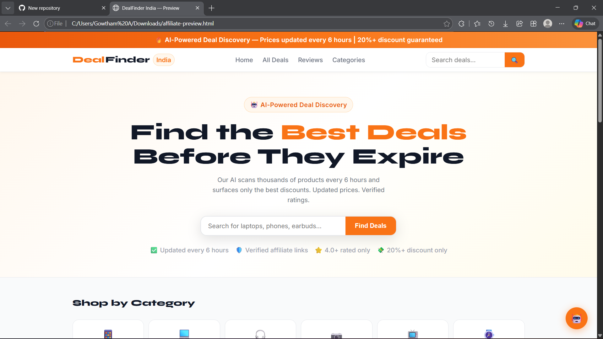
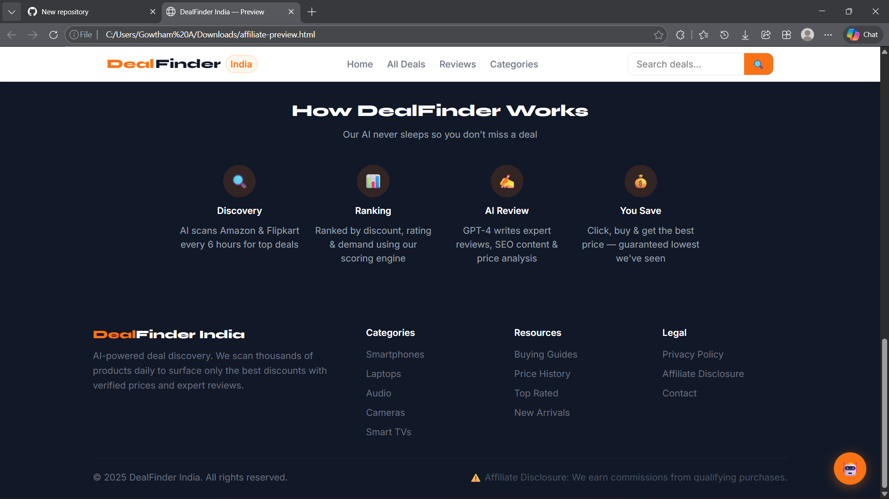
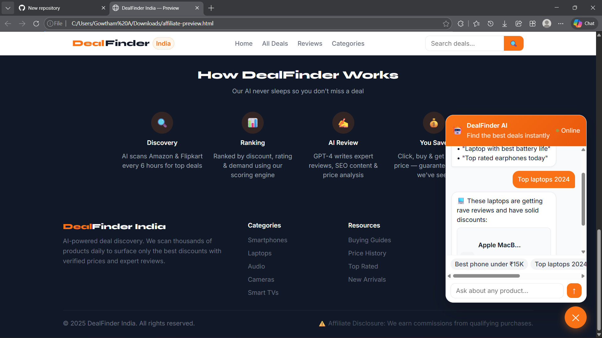

# 🚀 AI Affiliate Marketing Platform

A fully automated affiliate marketing system powered by GPT-4, Node.js, Next.js, and MongoDB.

---

## 🧩 System Architecture

```
┌─────────────────────────────────────────────────────────────────┐
│                        INTERNET / USERS                         │
└──────────────────────────────┬──────────────────────────────────┘
                               │ HTTPS
┌──────────────────────────────▼──────────────────────────────────┐
│                     NGINX (Reverse Proxy)                       │
│              Port 80/443 → routes / and /api/                   │
└──────────┬────────────────────────────────────────┬────────────┘
           │ /                                       │ /api/*
┌──────────▼──────────┐                  ┌──────────▼──────────┐
│   NEXT.JS FRONTEND  │                  │  EXPRESS BACKEND    │
│   Port 3000         │                  │  Port 5000          │
│                     │                  │                     │
│  pages/             │◄────────SWR─────►│  routes/            │
│   index.js          │   REST API       │   products.js       │
│   products/         │                  │   content.js        │
│   products/[slug]   │                  │   publish.js        │
│                     │                  │   chat.js           │
│  components/        │                  │   analytics.js      │
│   ProductCard       │                  │                     │
│   ChatWidget        │                  │  services/          │
│   Layout            │                  │   productDiscovery  │
└─────────────────────┘                  │   rankingEngine     │
                                         │   contentGenerator  │
                                         │   priceTracker      │
                                         └──────────┬──────────┘
                                                    │
                    ┌───────────────────────────────▼──────────────────────────┐
                    │                    AUTOMATION LAYER                      │
                    │  automation/scheduler.js (node-cron)                     │
                    │                                                           │
                    │  ⏰ Every 6h  → Price Tracker                            │
                    │  ⏰ Every 12h → Product Discovery (Amazon + Flipkart)   │
                    │  ⏰ Daily 2am → AI Content Generation (GPT-4)           │
                    │  ⏰ Daily 2:30am → Auto Publisher                       │
                    └───────────────────────────────┬──────────────────────────┘
                                                    │
                    ┌───────────────────────────────▼──────────────────────────┐
                    │                    DATA LAYER                            │
                    │                                                           │
                    │  MongoDB (Mongoose)         Redis (Cache)                │
                    │   ├── Products collection    └── API response cache      │
                    │   └── BlogPosts collection                               │
                    │                                                           │
                    │  External APIs:                                          │
                    │   ├── Amazon PA-API 5.0 (products + prices)             │
                    │   ├── Flipkart Affiliate API (products + prices)        │
                    │   └── OpenAI GPT-4 (content + chat)                    │
                    └──────────────────────────────────────────────────────────┘
```

---

## 📁 Folder Structure

```
affiliate-platform/
├── backend/
│   ├── models/
│   │   ├── Product.js          # MongoDB product schema + price history
│   │   └── BlogPost.js         # Published blog post schema
│   ├── routes/
│   │   ├── products.js         # GET/POST /api/products
│   │   ├── content.js          # POST /api/content/generate
│   │   ├── publish.js          # POST /api/publish
│   │   ├── chat.js             # POST /api/chat (AI assistant)
│   │   └── analytics.js        # GET /api/analytics/dashboard
│   ├── services/
│   │   ├── productDiscovery.js # Amazon + Flipkart API clients
│   │   ├── rankingEngine.js    # Weighted ranking algorithm
│   │   ├── contentGenerator.js # GPT-4 content generation
│   │   └── priceTracker.js     # Price update logic
│   ├── utils/
│   │   └── logger.js           # Winston structured logging
│   ├── automation/
│   │   └── scheduler.js        # node-cron job orchestrator
│   ├── server.js               # Express app entry point
│   ├── Dockerfile
│   └── package.json
│
├── frontend/
│   ├── pages/
│   │   ├── index.js            # Homepage: hero, trending, categories
│   │   ├── products/
│   │   │   ├── index.js        # Product listing with filters
│   │   │   └── [slug].js       # Product detail + blog + price chart
│   │   └── _app.js             # App shell
│   ├── components/
│   │   ├── Layout.js           # Navbar + footer + chat widget
│   │   ├── ProductCard.js      # Reusable product card
│   │   └── ChatWidget.js       # Floating AI chat assistant
│   ├── lib/
│   │   └── api.js              # Axios API client
│   ├── styles/
│   │   └── globals.css         # Tailwind + custom CSS
│   ├── Dockerfile
│   └── package.json
│
├── docker-compose.yml          # Full stack Docker deployment
├── nginx.conf                  # Reverse proxy config
└── README.md
```

---

## 🚀 Deployment Steps

### Option 1: Local Development (Quickest)

```bash
# 1. Clone and setup backend
cd backend
cp .env.example .env
# Edit .env with your API keys
npm install
npm run dev

# 2. Start MongoDB locally
mongod --dbpath /data/db

# 3. Setup frontend (new terminal)
cd frontend
cp .env.example .env
npm install
npm run dev

# 4. Start scheduler (new terminal)
cd backend
npm run cron
```

Visit: http://localhost:3000

---

### Option 2: Docker Compose (Recommended)

```bash
# 1. Copy and fill env
cp .env.example .env
# Fill in: OPENAI_API_KEY, AMAZON_*, FLIPKART_*, ADMIN_API_KEY, JWT_SECRET

# 2. Build and start all services
docker-compose up -d --build

# 3. Check logs
docker-compose logs -f backend
docker-compose logs -f scheduler

# 4. Trigger initial product discovery manually
curl -X POST http://localhost:5000/api/products/discover \
  -H "x-admin-key: YOUR_ADMIN_API_KEY" \
  -H "Content-Type: application/json" \
  -d '{"keywords": "best deals electronics", "category": "Electronics"}'
```

---

### Option 3: Production (VPS/Cloud)

```bash
# On your server (Ubuntu 22.04 recommended)

# 1. Install Docker
curl -fsSL https://get.docker.com | sh
sudo usermod -aG docker $USER

# 2. Clone repo
git clone https://github.com/yourname/affiliate-platform.git
cd affiliate-platform

# 3. Configure environment
cp .env.example .env
nano .env  # Fill in all API keys

# 4. Set up SSL (Let's Encrypt)
sudo apt install certbot
certbot certonly --standalone -d dealfinder.in -d www.dealfinder.in
# Copy certs to ./ssl/ directory

# 5. Update nginx.conf: uncomment the HTTPS redirect line

# 6. Deploy
docker-compose up -d --build

# 7. Monitor
docker-compose ps
docker-compose logs -f
```

---

## ⚙️ Automation Pipeline

The scheduler runs these jobs automatically:

| Job | Schedule | What it does |
|-----|----------|-------------|
| Price Tracker | Every 6 hours | Updates prices for all published products |
| Product Discovery | Every 12 hours | Fetches new products from Amazon + Flipkart |
| Content Generation | Daily 2:00 AM | GPT-4 generates blog posts for new products |
| Auto Publisher | Daily 2:30 AM | Publishes products with generated content |

---

## 🔑 Required API Keys

| Service | Where to get | Used for |
|---------|-------------|---------|
| OpenAI | platform.openai.com | Content generation + chat |
| Amazon PA-API | affiliate-program.amazon.com | Product data + affiliate links |
| Flipkart Affiliate | affiliate.flipkart.com | Product data + affiliate links |

**Note**: Without Amazon/Flipkart API keys, the system uses **mock products** automatically — great for testing!

---

## 📊 Key API Endpoints

```
GET  /api/products              # List products (paginated, filterable)
GET  /api/products/trending     # Get trending deals
GET  /api/products/:slug        # Get product detail
PATCH /api/products/:id/track   # Track click/view

POST /api/products/discover     # [Admin] Trigger discovery
POST /api/content/generate/:id  # [Admin] Generate AI content
POST /api/publish/:id           # [Admin] Publish product
POST /api/publish/auto          # [Admin] Auto-publish all ready

POST /api/chat                  # AI chat assistant
GET  /api/analytics/dashboard   # [Admin] Stats dashboard
```

Admin endpoints require `X-Admin-Key` header.

---

## 💡 Revenue Optimization Tips

1. **Amazon PA-API**: Apply for Amazon Associates India at associate.amazon.in
2. **Flipkart Affiliate**: Register at affiliate.flipkart.com
3. **Content quality**: GPT-4 generates 800-word reviews — more content = better SEO
4. **Price alerts**: Add email/WhatsApp notifications for price drops
5. **Category focus**: Stick to 2-3 high-commission categories (electronics = 4-8%)

---

## 🛡️ Production Checklist

- [ ] All env variables set in `.env`
- [ ] MongoDB secured with password
- [ ] Redis password set
- [ ] ADMIN_API_KEY is long and random
- [ ] JWT_SECRET is 32+ characters
- [ ] SSL certificate installed
- [ ] Nginx HTTPS redirect enabled
- [ ] Rate limiting tuned for your traffic
- [ ] MongoDB Atlas backup configured (for production)
- [ ] Affiliate disclosure page live (legal requirement)

---

*Built with ❤️ using Node.js, Next.js, MongoDB, and OpenAI GPT-4*
## Screenshorts


<p align="center">
       
